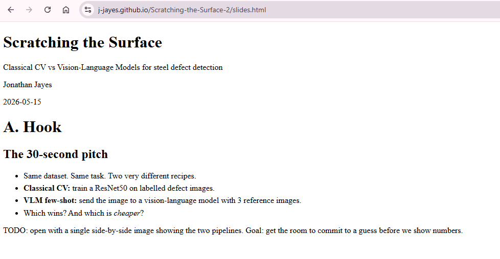

## The problem

I hit this bug again recently and it took me longer than I care to admit to track down, so writing it up here for future me.

My default workflow when starting a new project is to create a GitHub repo and grab GitHub's default `.gitignore` for Python. It's a sensible habit — the file covers the usual suspects and saves me from accidentally committing virtual environments or build artefacts. I also very frequently create a `website/` folder inside the repo with a Quarto project in it: some `.qmd` files that render to HTML, and often a set of slides in revealjs format. I use `output-dir: ../docs` to render everything out to `docs/`, then configure GitHub Pages to serve from that folder. Clean, simple, works great.

Until it doesn't.

The symptom is maddening: the site looks perfect locally, but after pushing to GitHub the reveal.js slides are completely unstyled — raw HTML, no fonts, no layout, no colour. Everything else on the site is fine.



## The cause

GitHub's default Python `.gitignore` contains this line:

```
dist/
```

That rule is there to ignore Python packaging build output. Completely reasonable. But Quarto renders reveal.js slides by copying the reveal.js library into `docs/site_libs/revealjs/dist/`, and that path matches `dist/` exactly. Git silently ignores the entire folder, so it never gets committed, and GitHub Pages never receives those files.

What lives in `dist/` that your slides need:

- `reveal.css` / `reset.css` — the core stylesheet
- `reveal.js` / `reveal.esm.js` — the core JavaScript
- `theme/` — fonts and the Quarto theme CSS

Without those, the browser gets the HTML but none of the presentation layer. Hence the raw dump of text.

## The fix

Add a negation rule immediately after the `dist/` entry in your `.gitignore`:

```
dist/
!docs/site_libs/revealjs/dist/
```

The `!` prefix un-ignores that specific path while leaving the broader `dist/` rule in place for everything else. After adding the rule, run:

```bash
git add docs/site_libs/revealjs/dist/
git commit -m "fix: un-ignore revealjs dist/ for GitHub Pages"
git push
```

Thanks current me!